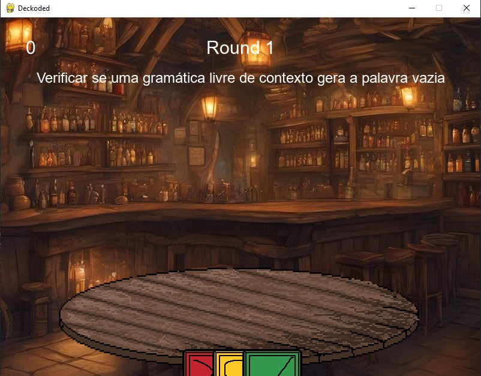

# 🚀 Deckoded

Deckoded é um jogo 2D de cartas o qual o jogador precisa escolher corretamente a carta que apresenta a solução para um problema.

---

## 🎯 Objetivo

### Deckoded tem como objetivo ensinar conceitos de **computabilidade, linguagens formais e complexidade de algoritmos** de maneira lúdica e interativa. O jogador precisa identificar corretamente se um problema apresentado é **decidível, semidecidível ou indecidível** usando cartas.

---

## 👨‍💻 Tecnologias e Softwares Utilizadas

- Python 3.13
- Pygame
- IDE Pycharm
- Piskel
- Inkscape

---

## 🗂️ Estrutura do Projeto
```
📦 Deckoded
├── 📁.idea
├── 📁assets
├── 📁scripts
│   ├── startgame.py
│   ├── api.py
│   ├── obj.py
│   ├── menu.py
│   ├── gameover.py
│   ├── game.py
│   ├── scene.py
│   ├── settings.py
│   ├── text.py
│   ├── ...
├── main.py
├── README.md
└── requirements.txt
```

---

## ⚙️ Como Executar

### ✅ Rodando Localmente

1. Clone o repositório:

```
git clone https://github.com/NicolasSkopek/Deckoded
cd Deckoded
```

2. Crie o ambiente virtual e ative:

```
python -m venv venv
source venv/bin/activate  # ou venv\Scripts\activate no Windows
```

3. Instale as dependências:

```
pip install -r requirements.txt
```

4. Execute a aplicação:

```
python main.py
```

---

## 📸 Demonstrações




---

## 👥 Equipe

| Nome                   | GitHub                                             |
|------------------------|----------------------------------------------------|
| Felipe Pereira Firmino | [felipeaj21](https://github.com/felipeaj21)        |
| Lucas Marques Ribeiro  | [lucasmri23](https://github.com/lucasmri23)        |
| Nicolas Skopek de Lima | [@NicolasSkopek](https://github.com/NicolasSkopek) |

---

## 🧠 Disciplinas Envolvidas

- Computabilidade e Complexidade de Algoritmos
- Linguagens Formais e Autômatos

---

## 🏫 Informações Acadêmicas

- Universidade: **Universidade Braz Cubas**
- Curso: **Ciência da Computação**
- Semestre: 6º
- Período: Noite
- Professora orientadora: **Dra. Andréa Ono Sakai**

---

## 📄 Licença

MIT License — sinta-se à vontade para utilizar, estudar e adaptar este projeto.
